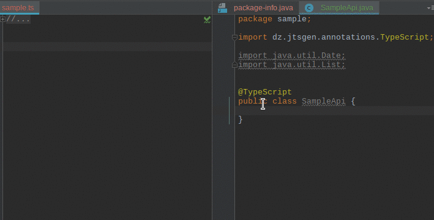

# _jtsgen_: Convert Java Types to TypeScript

**tl;dr** Enable code completion of Java types in your TypeScript project.

Annotations: 
 Processor: 
 
 
 

## Features

This project emits TypeScript types from Java sources.
`jtsgen` is implemented as an annotation processor, therefore it should be
easily integrated in your current build infrastructure. So here are the
prominent features:

* Emitting types for annotated Java classes and interfaces at *compile* time
* Several  module types and output variants supported
* read only and name space support
* configured at source the code location (package annotation)

The complete list of all features and all of the documentation is available on:
[http://jtsgen.readthedocs.io](http://jtsgen.readthedocs.io)

So here is a small demo:

As you can see, if the IDE is configured correctly, the java sources are
converted immediately.

## License And Legal Notes

**No Warranty**. As stated in the GPL v3 licence, there is no warranty
of any kind by using this software.

The following licenses apply `jtsgen`:

The **annotations** are **Apache 2.0** licensed. The **other parts** of `jtsgen`,
especially the processor, are **GPLv3** licensed. The license texts are
included in the file `LICENSE`. Because `jtsgen` as a sort of a compiler
plugin you shouldn't redistribute the compiler in your projects. It's
just like using OpenJDK: the generated code is *not* affected by
it's license, so it should be safe using it in most cases. Everything in
this chapter is not a legal advice in any form.

This project has to include the following legal notes:

* Oracle and Java are registered trademarks of Oracle and/or its affiliates.
  Other names may be trademarks of their respective owners. See
  https://www.oracle.com/legal/trademarks.html for details.

